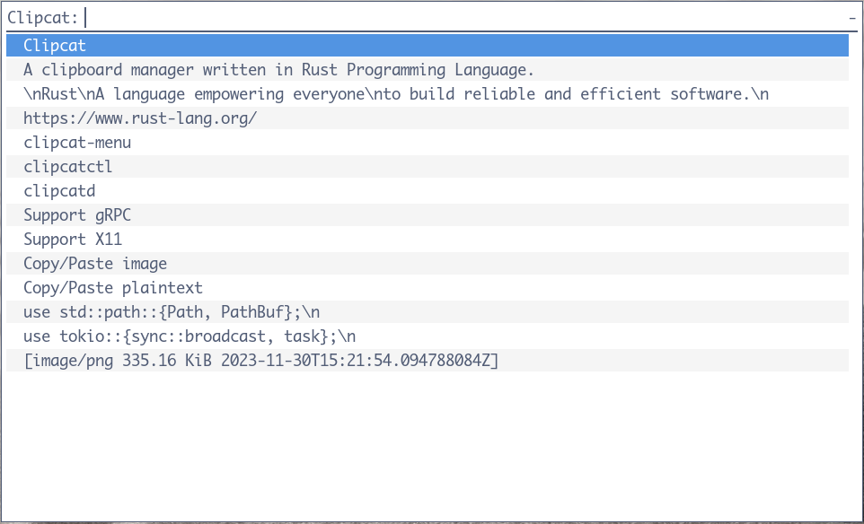
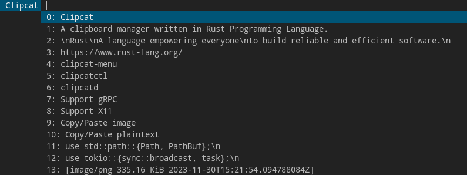

<h1 align="center">Clipcat</h1>

<p align="center">
    A clipboard manager written in
    <a href="https://www.rust-lang.org/" target="_blank">Rust Programming Language</a>.
</p>

<p align="center">
    <a href="https://github.com/xrelkd/clipcat/releases"></a>
    <a href="https://github.com/xrelkd/clipcat/actions?query=workflow%3ARust"></a>
    <a href="https://github.com/xrelkd/clipcat/actions?query=workflow%3ARelease"></a>
    <a href="https://github.com/xrelkd/clipcat/blob/master/LICENSE"></a>
</p>

**[Installation](#installation) | [Usage](#usage) | [Integration](#integration)**

<details>
<summary>Table of contents</summary>

- [Features](#features)
- [Installation](#installation)
- [Architecture](#architecture)
- [Usage](#usage)
- [Configuration](#configuration)
- [Integration](#integration)
- [Programs in this Repository](#programs-in-this-repository)
- [License](#license)

</details>

## Features

- [x] Copy/Paste plaintext
- [x] Copy/Paste image
- [x] Persistent contents of clipboard
- [x] Support snippets
- [x] Support `X11`
- [x] Support `Wayland` (experimentally)
- [x] Support `gRPC`
  - [x] gRPC over `HTTP`
  - [x] gRPC over `Unix domain socket`

## Screenshots

- Use [Rofi](https://github.com/davatorium/rofi) to select clip

  

- Use [dmenu](https://tools.suckless.org/dmenu/) to select clip

  

- Use [skim](https://github.com/lotabout/skim) to select clip

  

## Installation

<details>
<summary>Install with package manager</summary>

| Linux Distribution                  | Package Manager                     | Package                                                                                            | Command                                                                             |
| ----------------------------------- | ----------------------------------- | -------------------------------------------------------------------------------------------------- | ----------------------------------------------------------------------------------- |
| Various                             | [Nix](https://github.com/NixOS/nix) | [clipcat](https://github.com/NixOS/nixpkgs/blob/master/pkgs/applications/misc/clipcat/default.nix) | `nix profile install 'github:xrelkd/clipcat'` or <br> `nix-env -iA nixpkgs.clipcat` |
| [NixOS](https://nixos.org)          | [Nix](https://github.com/NixOS/nix) | [clipcat](https://github.com/NixOS/nixpkgs/blob/master/pkgs/applications/misc/clipcat/default.nix) | `nix profile install 'github:xrelkd/clipcat'` or <br> `nix-env -iA nixos.clipcat`   |
| [Arch Linux](https://archlinux.org) | [Yay](https://github.com/Jguer/yay) | [clipcat](https://aur.archlinux.org/packages/clipcat/)                                             | `yay -S clipcat`                                                                    |

</details>

<details>
  <summary>Build from source</summary>

`clipcat` requires the following tools and packages to build:

- `rustc`
- `cargo`
- `protobuf-compiler`

With the above tools and packages already installed, you can simply run:

```bash
$ git clone https://github.com/xrelkd/clipcat.git
$ cd clipcat

$ cargo install --path clipcatd
$ cargo install --path clipcatctl
$ cargo install --path clipcat-menu
```

</details>

## Architecture

Clipcat uses the Client-Server architecture. There are two role types in this architecture: `Server` and `Client`.

### Clipcat Server

A `clipcat` server (as known as daemon) is running as the background process and does the following routines:

- Watching the changes of `clipboard`.
- Caching the content of `clipboard`.
- Inserting content into `clipboard`.
- Serving as a `gRPC` server and waiting for remote procedure call from clients.

Currently, `clipcat` supports the following `windowing system`s:

- `X11`
  Leveraging the following `crate`s:
  - [x11rb](https://github.com/psychon/x11rb)
  - [arboard](https://github.com/1Password/arboard)
- `Wayland` (experimentally)
  Leveraging the following `crate`s:
  - [wl-clipboard-rs](https://github.com/YaLTeR/wl-clipboard-rs)
  - [arboard](https://github.com/1Password/arboard)

### Clipcat Client

A `clipcat` client sends requests to the server for the following operations:

- `List`: list the cached clips from server.
- `Insert`: replace the current content of `clipboard` with a clip.
- `Remove`: remove the cached clips from server.

### List of Implementations

| Program        | Role Type | Comment                                                                                |
| -------------- | --------- | -------------------------------------------------------------------------------------- |
| `clipcatd`     | `Server`  | The `clipcat` server (daemon)                                                          |
| `clipcatctl`   | `Client`  | The `clipcat` client which provides a command line interface                           |
| `clipcat-menu` | `Client`  | The `clipcat` client which calls built-in finder or external finder for selecting clip |

## Usage

0. Setup configurations for `clipcat`. Read [configuration](#configuration) section for more details.

```bash
$ mkdir -p                       $XDG_CONFIG_HOME/clipcat
$ clipcatd default-config      > $XDG_CONFIG_HOME/clipcat/clipcatd.toml
$ clipcatctl default-config    > $XDG_CONFIG_HOME/clipcat/clipcatctl.toml
$ clipcat-menu default-config  > $XDG_CONFIG_HOME/clipcat/clipcat-menu.toml
```

1. Start `clipcatd` for watching clipboard events.

```bash
$ clipcatd
```

2. Copy arbitrary text/image from other process with your mouse or keyboard.

3. You can run following commands with `clipcatctl` or `clipcat-menu`:

| Command                   | Comment                                           |
| ------------------------- | ------------------------------------------------- |
| `clipcatctl list`         | List cached clipboard history                     |
| `clipcatctl promote <id>` | Insert cached clip with `<id>` into X11 clipboard |
| `clipcatctl remove [ids]` | Remove cached clips with `[ids]` from server      |
| `clipcatctl clear`        | Clear cached clipboard history                    |

| Command               | Comment                                 |
| --------------------- | --------------------------------------- |
| `clipcat-menu insert` | Insert a cached clip into X11 clipboard |
| `clipcat-menu remove` | Remove cached clips from server         |
| `clipcat-menu edit`   | Edit a cached clip with `$EDITOR`       |

**Note**: Supported finders for `clipcat-menu`:

- built-in finder (integrate with crate [skim](https://github.com/lotabout/skim))
- [skim](https://github.com/lotabout/skim)
- [fzf](https://github.com/junegunn/fzf)
- [rofi](https://github.com/davatorium/rofi)
- [dmenu](https://tools.suckless.org/dmenu/)

## Configuration

| Program        | Default Configuration File Path              |
| -------------- | -------------------------------------------- |
| `clipcatd`     | `$XDG_CONFIG_HOME/clipcat/clipcatd.toml`     |
| `clipcatctl`   | `$XDG_CONFIG_HOME/clipcat/clipcatctl.toml`   |
| `clipcat-menu` | `$XDG_CONFIG_HOME/clipcat/clipcat-menu.toml` |

<details>
<summary>Configuration for <b>clipcatd</b></summary>

```toml
# run as a traditional UNIX daemon
daemonize = true
# max clip history limit
max_history = 50
# file path of clip history
history_file_path = "/home/<username>/.cache/clipcat/clipcatd-history"

[log]
# emit log message to a log file. Delete this line to disable emitting to a log file
file_path = "/path/to/log/file"
# emit log message to journald
emit_journald = true
# emit log message to stdout
emit_stdout = false
# emit log message to stderr
emit_stderr = false
# log level
level = "INFO"

[watcher]
# load current clipboard content at startup
load_current = true
# enable watching X11/Wayland clipboard selection
enable_clipboard = true
# enable watching X11/Wayland primary selection
enable_primary = true
# enable capturing image or not
capture_image = true
# ignore clips with a size <= `filter_min_size`, in bytes
filter_min_size = 1
# ignore clips with a size > `filter_max_size`, in bytes
filter_max_size = 5242880

[grpc]
# enable gRPC over http
enable_http = true
# enable gRPC over unix domain socket
enable_local_socket = true
# host address for gRPC
host = "127.0.0.1"
# port number for gRPC
port = 45045
# path of unix domain socket
local_socket = "/run/user/<user-id>/clipcat/grpc.sock"

# snippets, only UTF-8 text is supported.
[[snippets]]
# name of snippet
name = "os-release"

# file path to the snippet, if both `content` and `file_path` are provided, `file_path` is preferred
file_path = "/etc/os-release"

[[snippets]]
# name of snippet
name = "cxx-io-speed-up"

# content of the snippet, if both `content` and `file_path` are provided, `file_path` is preferred
content = '''
int io_speed_up = [] {
    std::ios::sync_with_stdio(false);
    std::cin.tie(nullptr);
    std::cout.tie(nullptr);
    return 0;
}();
'''

[[snippets]]
name = "rust-sieve-primes"
content = '''
fn sieve_primes(n: usize) -> Vec<usize> {
    if n < 2 {
        return Vec::new();
    }
    let root_n = f64::from(n as i32).sqrt().floor() as usize;
    let mut is_prime = vec![true; n + 1];
    for i in 2..=root_n {
        if !is_prime[i] {
            continue;
        }
        for j in ((i << 1)..=n).step_by(i) {
            is_prime[j] = false;
        }
    }
    is_prime
        .into_iter()
        .enumerate()
        .skip(2)
        .filter_map(|(i, x)| if x { Some(i) } else { None })
        .collect()
}
'''
```

</details>

<details>
<summary>Configuration for <b>clipcatctl</b></summary>

```toml
# server endpoint
# clipcatctl connects to server via unix domain socket if `server_endpoint` is a file path like:
# "/run/user/<user-id>/clipcat/grpc.sock".
# clipcatctl connects to server via http if `server_endpoint` is a URL like: "http://127.0.0.1:45045"
server_endpoint = "/run/user/<user-id>/clipcat/grpc.sock"

[log]
# emit log message to a log file. Delete this line to disable emitting to a log file
file_path = "/path/to/log/file"
# emit log message to journald
emit_journald = true
# emit log message to stdout
emit_stdout = false
# emit log message to stderr
emit_stderr = false
# log level
level = "INFO"
```

</details>

<details>
<summary>Configuration for <b>clipcat-menu</b></summary>

```toml
# server endpoint
# clipcat-menu connects to server via unix domain socket if `server_endpoint` is a file path like:
# "/run/user/<user-id>/clipcat/grpc.sock".
# clipcat-menu connects to server via http if `server_endpoint` is a URL like: "http://127.0.0.1:45045"
server_endpoint = "/run/user/<user-id>/clipcat/grpc.sock"

# the default finder to invoke when no "--finder=<finder>" option provided
finder = "rofi"

[log]
# emit log message to a log file. Delete this line to disable emitting to a log file
file_path = "/path/to/log/file"
# emit log message to journald
emit_journald = true
# emit log message to stdout
emit_stdout = false
# emit log message to stderr
emit_stderr = false
# log level
level = "INFO"

# options for "rofi"
[rofi]
# length of line
line_length = 100
# length of menu
menu_length = 30
# prompt of menu
menu_prompt = "Clipcat"

# options for "dmenu"
[dmenu]
# length of line
line_length = 100
# length of menu
menu_length = 30
# prompt of menu
menu_prompt = "Clipcat"

# customize your finder
[custom_finder]
# external program name
program = "fzf"
# arguments for calling external program
args = []
```

</details>

## Integration

<details>
<summary>Integrating with <a href="https://www.zsh.org/" target="_blank">Zsh</a></summary>

For a `zsh` user, it will be useful to integrate `clipcat` with `zsh`.

Add the following command in your `zsh` configuration file (`~/.zshrc`):

```bash
if type clipcat-menu >/dev/null 2>&1; then
    alias clipedit=' clipcat-menu --finder=builtin edit'
    alias clipdel=' clipcat-menu --finder=builtin remove'

    bindkey -s '^\' "^Q clipcat-menu --finder=builtin insert ^J"
    bindkey -s '^]' "^Q clipcat-menu --finder=builtin remove ^J"
fi
```

</details>

<details>
<summary>Integrating with <a href="https://i3wm.org/" target="_blank">i3 Window Manager</a></summary>

For a `i3` window manager user, it will be useful to integrate `clipcat` with `i3`.

Add the following options in your `i3` configuration file (`$XDG_CONFIG_HOME/i3/config`):

```
exec_always --no-startup-id clipcatd                # start clipcatd at startup

set $launcher-clipboard-insert clipcat-menu insert
set $launcher-clipboard-remove clipcat-menu remove

bindsym $mod+p exec $launcher-clipboard-insert
bindsym $mod+o exec $launcher-clipboard-remove
```

**Note**: You can use `rofi` or `dmenu` as the default finder.

</details>

## Programs in this Repository

| Program          | Description                                                                             |
| ---------------- | --------------------------------------------------------------------------------------- |
| `clipcatd`       | The `clipcat` server (daemon).                                                          |
| `clipcatctl`     | The `clipcat` client which provides a command line interface.                           |
| `clipcat-menu`   | The `clipcat` client which calls built-in finder or external finder for selecting clip. |
| `clipcat-notify` | A tool for watching clipboard event. <br>                                               |
|                  | It watches the clipboard and exit on clipboard changed. <br>                            |
|                  | It returns exit code 0 if success, 1 if error occurred. <br>                            |
|                  | **Note**: It does not interact with `clipcatd`, `clipcatctl`, `clipcat-menu`, <br>      |
|                  | it is just a tool for watching clipboard.                                               |

## License

Clipcat is licensed under the GNU General Public License version 3. See [LICENSE](./LICENSE) for more information.
